<div align="center">

# 🛎 oncall — the AI on-call engineer

**Watches your CI/CD. Triages every failure. Fixes what's safe. Asks you when it isn't.**

Built as a [Lemma](https://lemma.work) Pod — agents, workflows, functions, tables, schedules, connectors and a custom app, working as one product.

**[▶ Live dashboard (Private - Only accessible by invite](https://oncall-dashboard-harsh-dev.apps.lemma.work)**

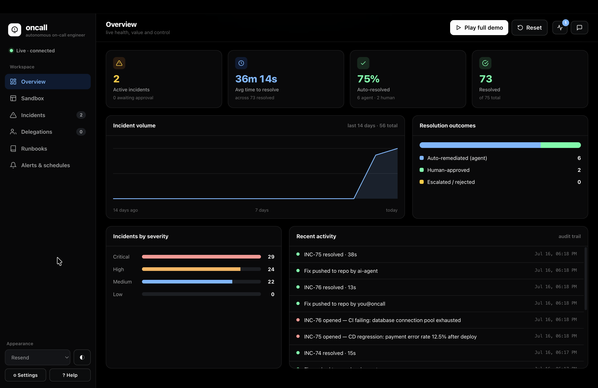
<em>The Overview: live MTTR, auto-resolution rate, incident volume, resolution outcomes and a full audit trail — the health of your ops at a glance.</em>

</div>

---

## Table of contents

1. [The idea](#the-idea)
2. [Product tour](#product-tour)
   - [Sandbox — mission control](#1-sandbox--mission-control-for-your-projects)
   - [Break something, safely](#2-break-something-safely)
   - [Transparent triage & human approval](#3-transparent-triage--human-in-the-loop-approval)
   - [Delegations — agent or human](#4-delegations--every-fix-routed-to-the-agent-or-a-human)
   - [The solver agent](#5-the-solver-agent--it-actually-writes-the-fix)
   - [Runbooks — editable AI knowledge](#6-runbooks--the-knowledge-the-ai-acts-on)
   - [Alerts, schedules & channels](#7-alerts-schedules--full-slacktelegram-control)
   - [Autonomy settings](#8-autonomy--you-decide-how-much-leash-the-ai-gets)
   - [Activity tray & chat](#9-always-know-whats-happening)
   - [Themes](#10-themes)
3. [How it works](#how-it-works)
4. [Built on Lemma](#built-on-lemma)
5. [Repository layout](#repository-layout)
6. [Getting started](#getting-started)
7. [Trust & guardrails](#trust--guardrails)

---

## The idea

Small teams don't have an SRE. When a pipeline fails at 2am, someone gets paged, digs
through logs, guesses at a fix, and forgets to write the post-mortem.

**oncall** does that job autonomously:

| Step | What oncall does |
| --- | --- |
| 👀 **Detect** | Watches each project's CI/CD pipelines and service health |
| 🧠 **Triage** | Diagnoses root cause and computes a **transparent 0–100 triage score** you can audit |
| 🚦 **Decide** | Runbook-gated: fixes what's marked safe on its own, asks a human for everything else (Slack/Telegram) |
| 🤖 **Fix** | A **solver agent** patches the code, runs the tests, opens a PR and merges it |
| 📄 **Learn** | Writes a blameless post-mortem and appends the lesson to the service's runbook |

---

## Product tour

### 1. Sandbox — mission control for your projects

Two demo projects ship out of the box (`shopfront-web` on GitHub, `payments-api` on
GitLab), and you can connect your own. Each project gets a **live preview** of the
deployed app, **Grafana-style service metrics**, the **CI/CD pipeline history**, and a
**live log tail**.

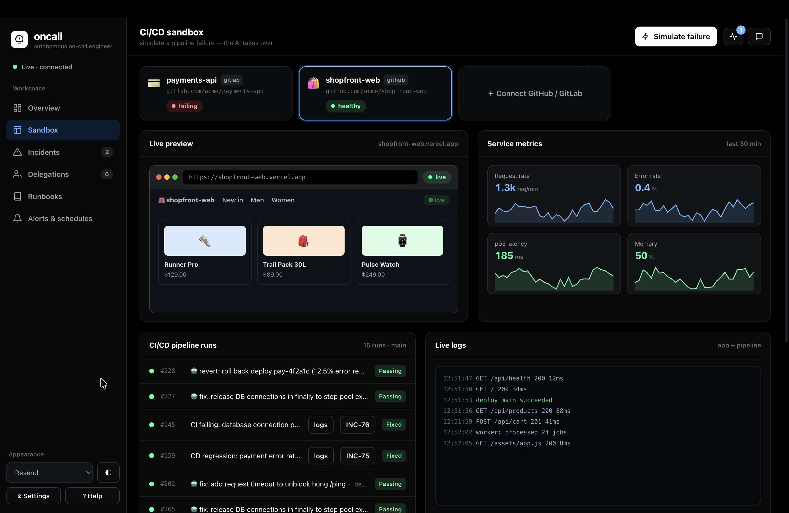
<p align="center"><em>A healthy project: the storefront is live, metrics are green, the pipeline is passing — note the 🤖 commits already pushed by the agent.</em></p>

### 2. Break something, safely

**Simulate failure** injects one of five realistic pipeline failures — DB pool
exhaustion, a bad deploy, an OOM build, gateway GC thrash, a flaky healthcheck. The
preview flips to a **502**, metrics spike red, error lines hit the logs, and an incident
opens instantly.

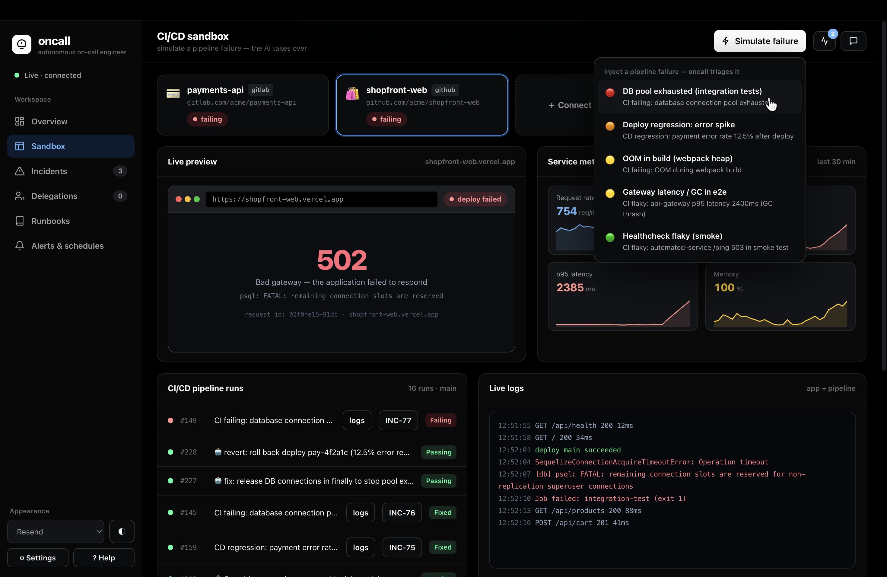
<p align="center"><em>One click of "Simulate failure" and the site is down: 502 page with the real error signature, latency at 2385ms, memory pegged at 100%, and the failing run in the pipeline — oncall is already triaging.</em></p>

### 3. Transparent triage & human-in-the-loop approval

Every incident gets a **triage score built from auditable math** — severity, blast
radius, off-hours, confidence — shown factor by factor. Runbook-safe fixes proceed
automatically; anything critical or unsafe stops and asks you.

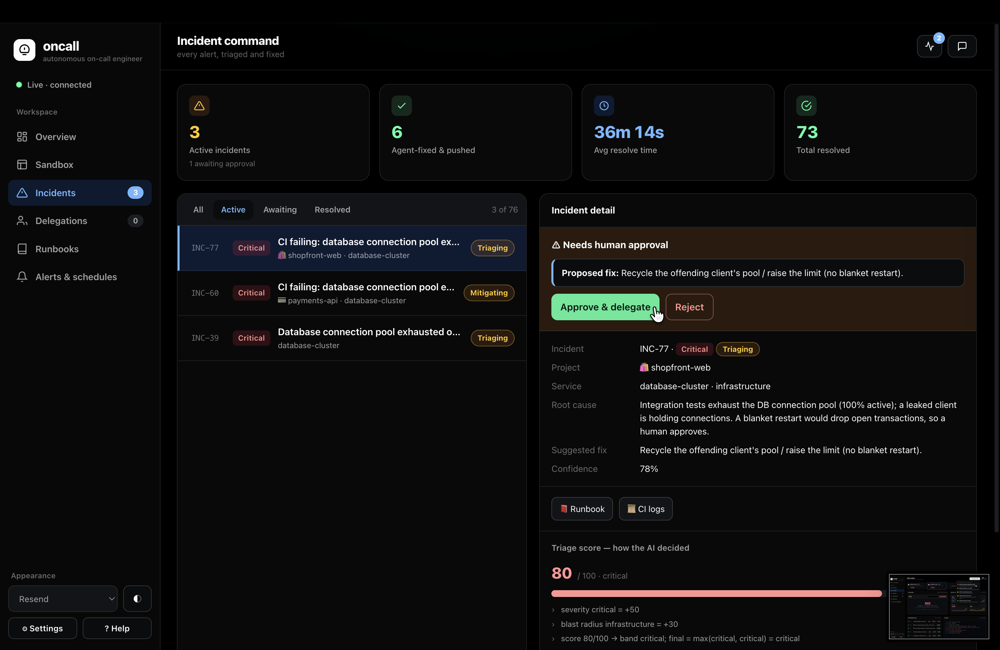
<p align="center"><em>A critical DB incident waits for a human: the proposed fix, root cause, confidence, and the full 80/100 score breakdown (critical +50, infrastructure +30). Approve & delegate — or reject.</em></p>

### 4. Delegations — every fix routed to the agent or a human

Approved fixes land on a tactile kanban and are **auto-routed by severity**: critical →
a human, everything else → the AI agent. You can always override — take it yourself, or
hand it to the agent.

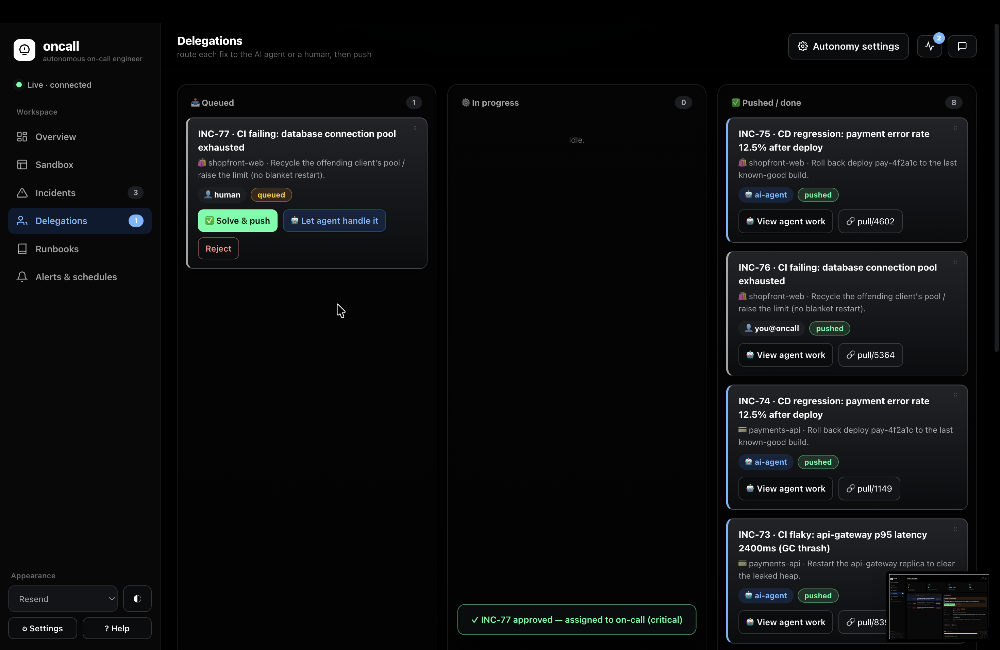
<p align="center"><em>The delegation board: a critical fix queued for a human (with "Let agent handle it" as the override), and a column of fixes already pushed — each with its PR link.</em></p>

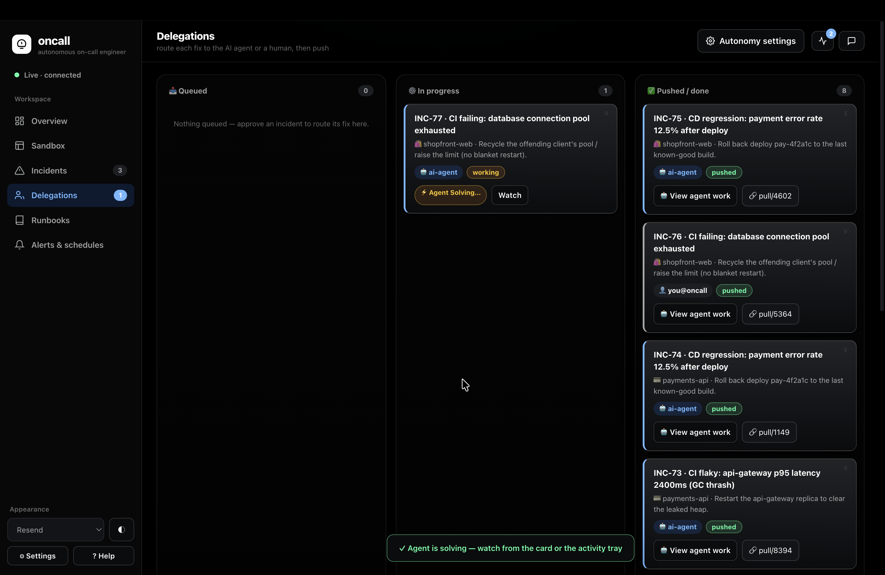
<p align="center"><em>The agent picks up a delegation and starts solving — watch live from the card or the activity tray.</em></p>

### 5. The solver agent — it actually writes the fix

The heart of the demo: the solver agent clones the repo, reads the failed pipeline,
matches the runbook, **edits the code (real diff), runs the tests, commits, opens a PR
and merges on green**. Every step is streamed to a console you can replay later.

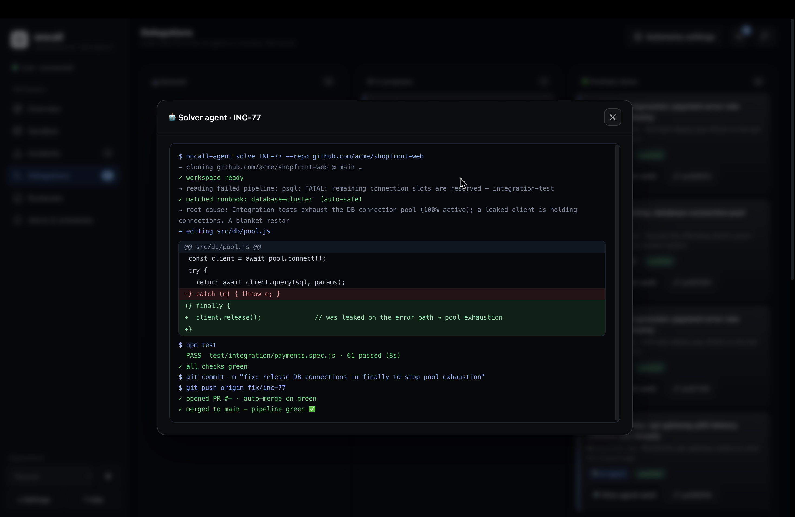
<p align="center"><em>The solver agent fixing INC-77: it finds the leaked DB connection on the error path, adds <code>client.release()</code> in a <code>finally</code>, passes 61 tests, and merges the PR — pipeline green.</em></p>

### 6. Runbooks — the knowledge the AI acts on

Runbooks are the AI's playbook per service: the signals, the fix, and the deterministic
**auto-remediation-safe** verdict that gates autonomy. Full CRUD, file upload, and a
split-pane markdown editor with live preview.

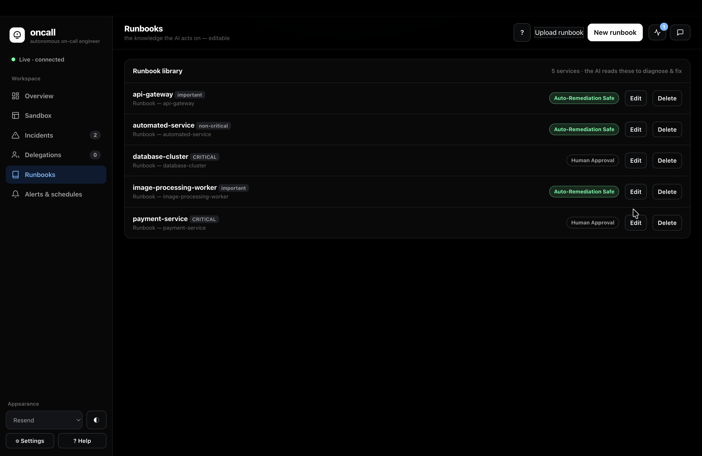
<p align="center"><em>The library: five services, each labeled auto-remediation-safe (agent may act alone) or human-approval (always asks). Money-path and infra are human-only.</em></p>

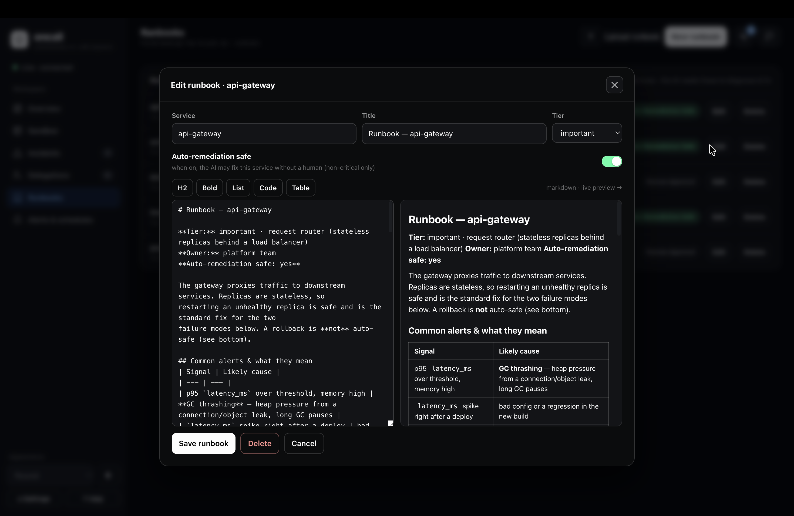
<p align="center"><em>Editing the api-gateway runbook: metadata, the auto-safe toggle, a formatting toolbar and live markdown preview — what you write here is what the AI reads.</em></p>

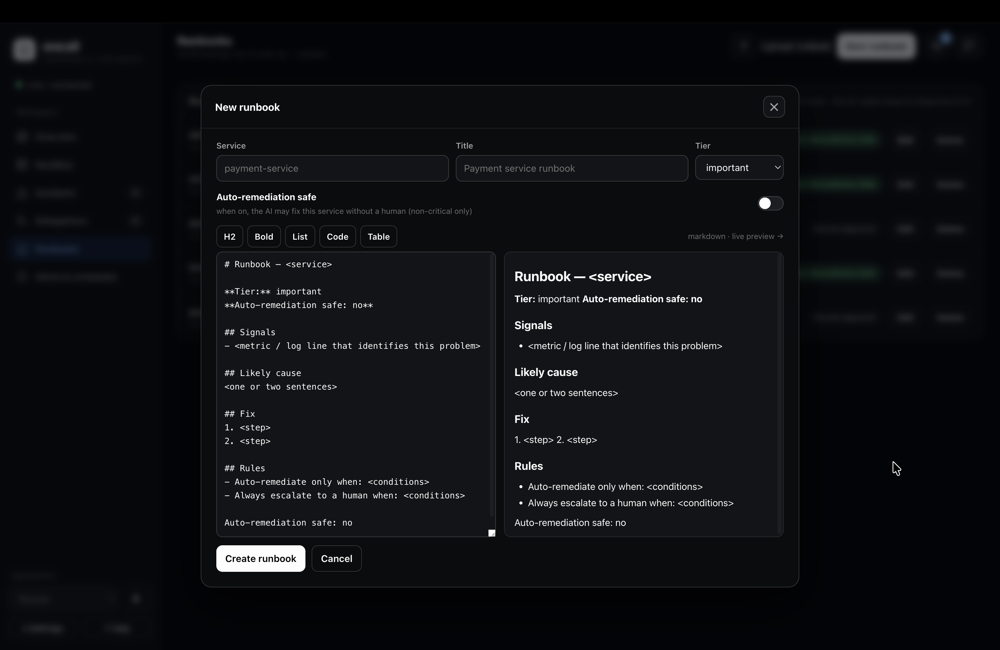
<p align="center"><em>New runbooks start from a structured template — Signals, Likely cause, Fix, and explicit Rules for when to auto-remediate vs. escalate.</em></p>

### 7. Alerts, schedules & full Slack/Telegram control

Slack and Telegram are first-class: connection status, per-channel targets, live test
sends, an **event × channel notification matrix** (scopable per project), and a
**scheduled ops digest** whose cron you edit right from the UI. Agent- and
human-delegation events route to their own dedicated Slack channels.

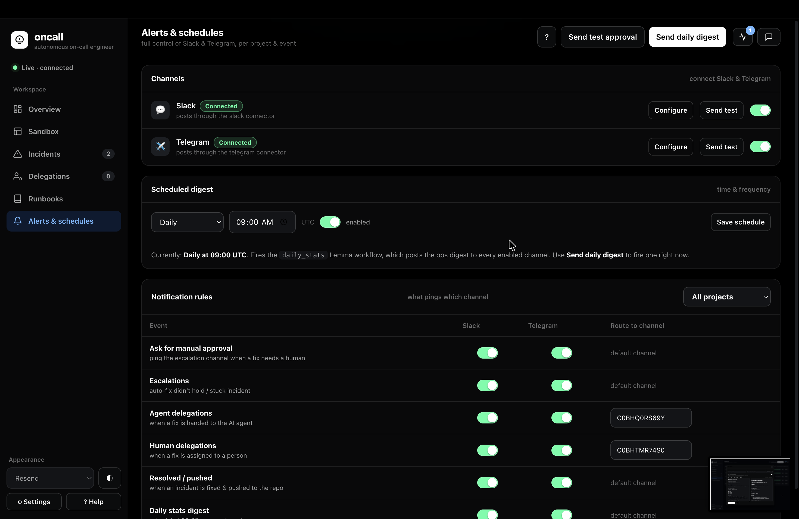
<p align="center"><em>Channels with Configure/Send test, the daily digest schedule (rewrites the real Lemma cron), and the notification-rules matrix — note the dedicated channel IDs for agent and human delegations.</em></p>

### 8. Autonomy — you decide how much leash the AI gets

One settings panel governs the whole system: autonomous mode, a confidence threshold,
the maximum severity the agent may auto-handle, and an infrastructure lockout. These
limits **only tighten** what the runbook already allows — never loosen it.

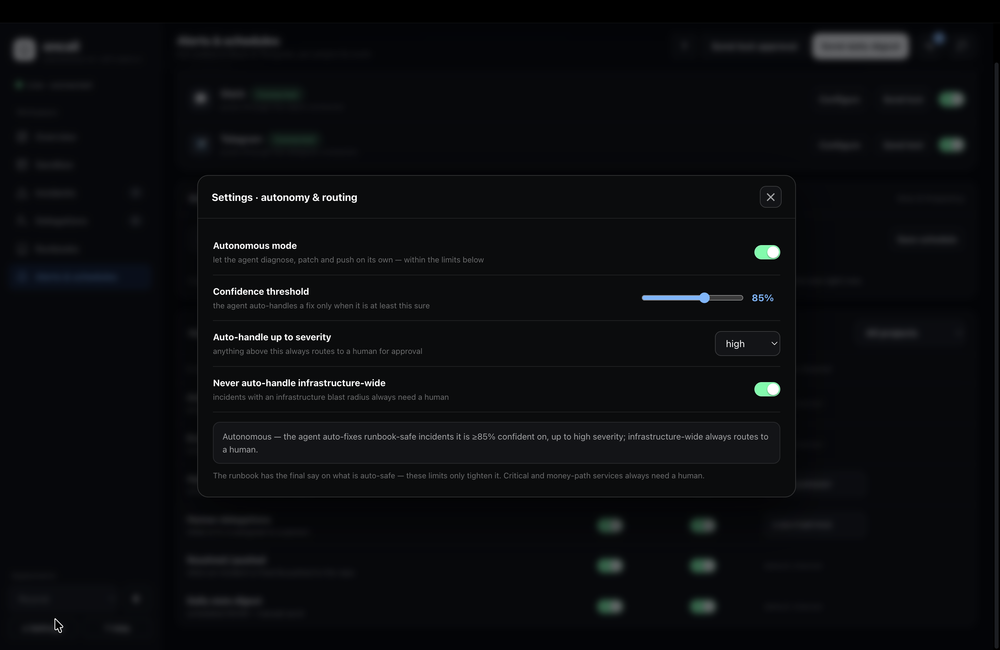
<p align="center"><em>The autonomy dial: ≥85% confidence, up to high severity, never infrastructure-wide — and a plain-English readout of the current policy.</em></p>

### 9. Always know what's happening

Nothing runs hidden. The **activity tray** shows everything in flight — agent solves,
approvals waiting on you, incidents mitigating — and the **Ask oncall** chat drawer
talks to the same on-call responder agent that answers you on Slack and Telegram.

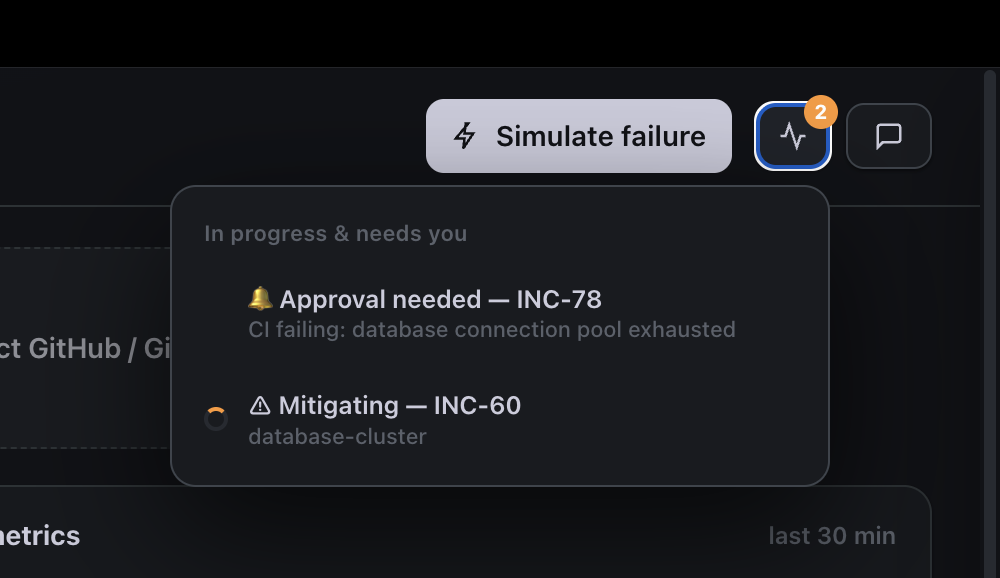
<p align="center"><em>The activity tray: one glance shows an approval waiting and an incident mid-mitigation; click any item to jump straight to it.</em></p>

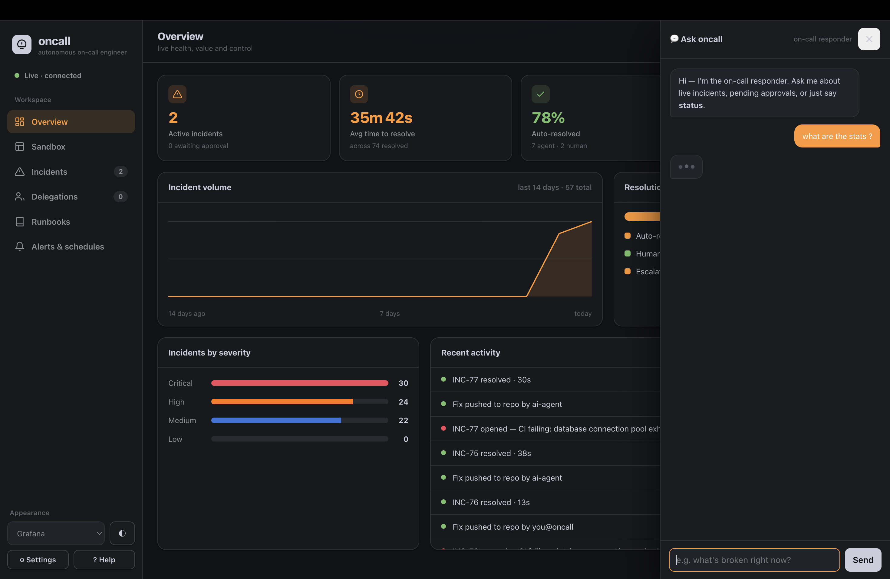
<p align="center"><em>"Ask oncall" — a streaming chat with the on-call responder agent, right in the dashboard (shown here in the Grafana theme).</em></p>

### 10. Themes

Six carefully-built themes — **Resend** (default), **Linear**, **Grafana**, **Harness**,
**CodeRabbit** — each with light and dark modes. Every chart, badge and panel re-colors
live.

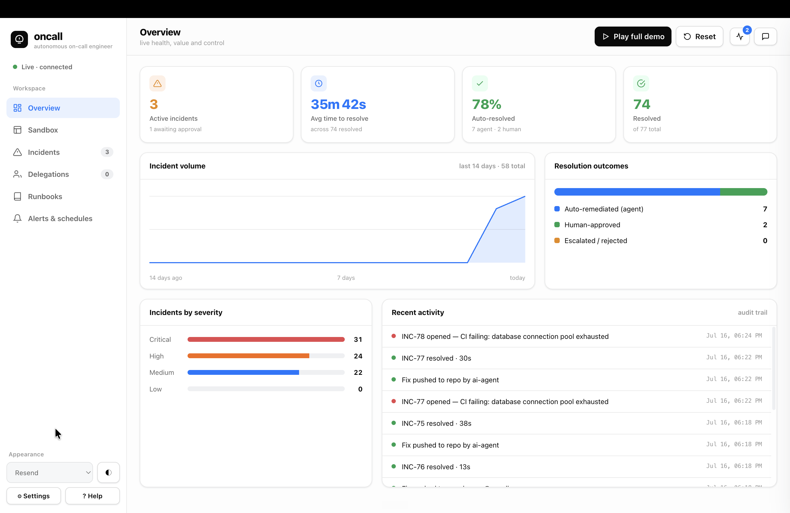
<p align="center"><em>The same Overview in Resend light mode — theme and light/dark are independent controls in the sidebar.</em></p>

---

## How it works

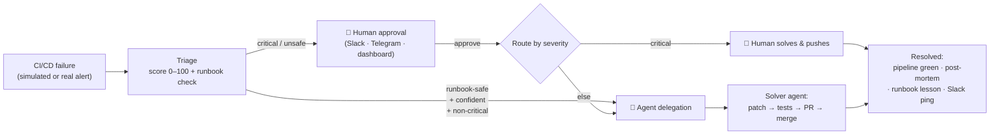

Two execution paths coexist:

- **Production pipeline** — a row in the `alerts` table triggers the `incident_response`
  Lemma workflow: dedupe/correlate → `incident_analyst` agent → deterministic safety
  gates (`open_incident`) → auto-execute or human approval form → remediation →
  `postmortem_writer` agent → publish. Cron workflows handle health polling
  (`health_check`), self-healing retries (`heal`), and the daily digest (`daily_stats`).
- **Dashboard demo path** — the app drives the same lifecycle directly on the Lemma
  datastore for instant feedback, while still firing a pre-linked alert so the real
  workflow runs and its history stays live. Slack/Telegram sends go through the Lemma
  connector.

**Everything the LLM proposes is checked by deterministic code**: real severity comes
from the alert, `auto_safe` comes from the runbook table, the triage formula is pure
math, and the approval gate is enforced in a function — not in a prompt.

---

## Built on Lemma

This project deliberately exercises the full Lemma platform:

| Primitive | What we built with it |
| --- | --- |
| **Tables** (11) | `projects`, `ci_runs`, `incidents`, `remediation_actions`, `delegations`, `runbooks`, `alert_rules`, `notification_settings`, `monitored_services`, `alerts` |
| **Functions** (11) | `dedupe_and_correlate`, `open_incident` (safety gates + triage), `triage_score`, `execute_remediation`, `heal`, `notify`, `resolve_approval`, `publish_postmortem`, `daily_stats`, `probe_service`, `_bootstrap` |
| **Agents** (3) | `incident_analyst` (diagnosis), `oncall_responder` (Slack/Telegram/dashboard chat + approvals), `postmortem_writer` (blameless post-mortems + self-improving runbooks) |
| **Workflows** (4) | `incident_response` (the end-to-end loop with a human approval FORM step), `health_check`, `heal`, `daily_stats_wf` |
| **Schedules** (4) | datastore trigger on `alerts`, minutely health poll, 2-minute heal loop, editable daily-digest cron |
| **Connectors** | Slack + Telegram sends, with per-event channel routing |
| **Surfaces** | Slack & Telegram chat backed by `oncall_responder` — reply “approve INC-42” and it happens |
| **App** | The entire dashboard — a single self-contained SPA on the Lemma browser SDK |

---

## Repository layout

```
pod.json                       Pod identity + connector account variables
deploy.ps1                     Pinned deploy script (org + pod) — always deploy through this
scripts/build_bootstrap.py     Re-embeds files/runbooks/*.md into the _bootstrap seed function
agents/                        incident_analyst · oncall_responder · postmortem_writer
functions/                     All Python functions (triage gates, remediation, heal, notify…)
workflows/                     incident_response · health_check · heal · daily_stats_wf
schedules/                     alert_trigger · health_poll · heal · daily_stats
surfaces/                      slack · telegram chat surfaces
tables/                        The full data model (11 tables)
files/runbooks/*.md            Human-readable runbook sources (seeded into the runbooks table)
apps/oncall-dashboard/         The dashboard app — source/index.html is the whole SPA
screenshotsOncall/             The screenshots used in this README
seed/                          Legacy CLI trigger payloads (superseded by the dashboard)
```

---

## Getting started

**Prerequisites:** the [Lemma CLI](https://lemma.work), authenticated against the target org.

```powershell
# Deploy everything — tables, functions, agents, workflows, schedules, surfaces + the app
.\deploy.ps1
```

The script pins the canonical org/pod, seeds runbooks + monitored services via
`_bootstrap`, and deploys the dashboard.

**Edit a runbook** in `files/runbooks/*.md`, then:

```powershell
python scripts/build_bootstrap.py   # re-embed the markdown
.\deploy.ps1                        # re-import + reseed
```

(or just edit it live in the dashboard's Runbooks tab).

**Run the demo:**

1. Open the dashboard → the onboarding deck introduces the product (or hit **? Help**).
2. **Overview → Play full demo** for the hands-free version.
3. **Sandbox → Simulate failure** → watch the preview break and the incident open.
4. **Incidents** → see the triage math → approve the critical one.
5. **Delegations** → watch the solver agent patch, test and merge — or solve one yourself.
6. **Sandbox** goes green with the agent's 🤖 fix commit.
7. Check Slack/Telegram — approvals, delegation pings and the resolution all landed.

---

## Trust & guardrails

- The **runbook's `auto_safe` flag is the ceiling** on autonomy; the autonomy dial can
  only tighten it.
- **Critical severity and infrastructure-wide blast radius always route to a human** —
  regardless of settings.
- The triage score is **deterministic and fully displayed** — no black-box decisions.
- Every automated fix is a **reviewable PR**, not a silent production mutation.
- Every action — AI or human — lands in the **audit trail**, the incident timeline, and
  a **blameless post-mortem**.

---

<div align="center">
<sub>Built for the Lemma hackathon · dashboard UI in a single HTML file · every screenshot above is the live product</sub>
</div>
